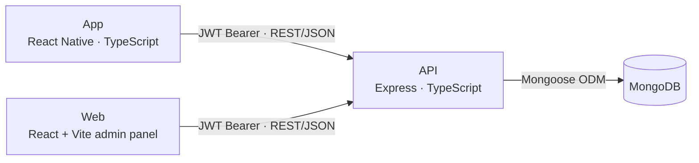
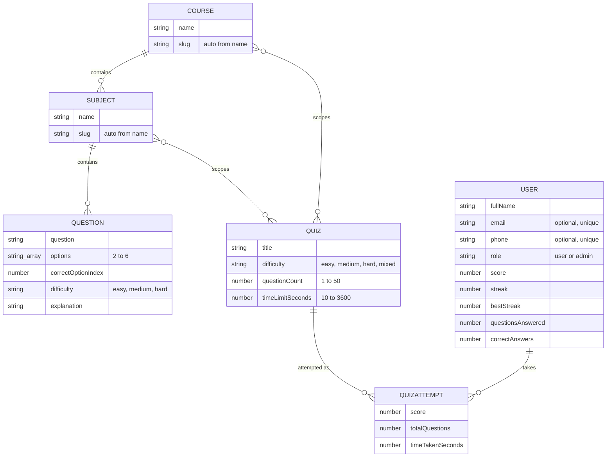

# LMS — Project Plan

Architecture overview and phased roadmap, built from the current codebase rather than a wishlist. See also `.claude/skills/api/SKILL.md`, `.claude/skills/app/SKILL.md`, and `.claude/skills/web/SKILL.md` for the house-style conventions each piece follows.

## Contents

- [Product overview](#product-overview)
- [System architecture](#system-architecture)
- [Data model](#data-model)
- [API surface](#api-surface)
- [Mobile app](#mobile-app)
- [Web admin](#web-admin)
- [Current-state gaps](#current-state-gaps)
- [Roadmap](#roadmap)

## Product overview

LMS is a course-based learning platform: users browse **courses** (top-level subjects like "Science" or "History"), which contain **subjects**, which questions belong to — and take timed, multi-question **quizzes** scoped to one or more courses/subjects to test their knowledge. Score, streak, and achievements are tracked per user and surfaced on a profile tab.

A separate web admin panel gives staff a CRUD interface over courses, subjects, questions (including bulk Excel import), quizzes, and users — gated behind an admin-role login.

## System architecture

Two clients, one API, one database. No services layer, no message queue, no cache tier — a deliberately small footprint for the current stage.



**Auth model.** Stateless JWT, issued on register/login/OTP-verify and sent as a Bearer token. Two entry points: `email + password` (register/login) or `phone + OTP` (send-otp/verify-otp, account auto-created on first OTP request). `middleware/Auth.ts` exposes `protect` (any authenticated user) and `adminOnly` (requires `role: "admin"`) — every admin-only route below is gated by both.

**No services layer.** Controllers call Mongoose models directly — there's no intermediate service/repository tier. This keeps the API thin, but it's also why business logic (scoring, streak updates, slug generation) lives inside controllers and model hooks rather than a shared layer; worth watching as rules grow more complex.

## Data model

Six Mongoose collections. Courses and subjects form the content hierarchy; quizzes and quiz attempts are the graded, timed assessment layer built on the underlying question bank.



Field names shown are the subset relevant to the plan — see `API/src/models/` for the full schemas (timestamps, validators, indexes).

## API surface

31 routes across six resources. `asyncHandler` wraps every controller; expected failures return a status + message rather than throwing.

### Auth — `/api/auth`

| Method | Route | Auth | Does |
|---|---|---|---|
| POST | `/register` | public | Email + password sign-up, returns JWT |
| POST | `/login` | public | Email + password sign-in |
| POST | `/send-otp` | public | Issues a 6-digit code for a phone number (SMS not wired up — see gaps) |
| POST | `/verify-otp` | public | Verifies the code, creates/logs in the phone account |
| GET | `/me` | user | Current profile |
| PUT | `/me` | user | Update full name / email |
| PUT | `/me/password` | user | Change password (requires current) |

### Questions — `/api/questions`

| Method | Route | Auth | Does |
|---|---|---|---|
| GET | `/` | admin | Paginated list |
| POST | `/` | admin | Create one |
| POST | `/bulk` | admin | Bulk create (Excel import from Web) |
| PUT | `/:id` | admin | Update |
| DELETE | `/:id` | admin | Delete |

### Courses & Subjects

| Method | Route | Auth | Does |
|---|---|---|---|
| GET | `/api/courses` | user | List courses |
| POST | `/api/courses` | admin | Create (slug auto-generated) |
| PUT | `/api/courses/:id` | admin | Update |
| DELETE | `/api/courses/:id` | admin | Delete |
| GET | `/api/subjects` | user | List, optional `?course=` filter |
| POST | `/api/subjects` | admin | Create (requires a course) |
| PUT | `/api/subjects/:id` | admin | Update |
| DELETE | `/api/subjects/:id` | admin | Delete |

### Quizzes & Users

| Method | Route | Auth | Does |
|---|---|---|---|
| GET | `/api/quizzes/available` | user | Quizzes the user can take |
| GET | `/api/quizzes/:id/start` | user | Starts an attempt, returns its questions |
| POST | `/api/quizzes/:id/submit` | user | Submits answers, returns graded results |
| GET | `/api/quizzes` | admin | Paginated list |
| POST | `/api/quizzes` | admin | Create |
| PUT | `/api/quizzes/:id` | admin | Update |
| DELETE | `/api/quizzes/:id` | admin | Delete |
| GET | `/api/users` | admin | Paginated list |
| PUT | `/api/users/:id` | admin | Update (e.g. deactivate) |
| DELETE | `/api/users/:id` | admin | Delete |
| POST | `/api/users/:id/reset-score` | admin | Resets score/streak |

## Mobile app

React Native bare CLI. React Context for auth state (no Redux); a single axios instance injects the JWT.

```
RootNavigator   (auth stack ⇄ main tabs, gated by AuthContext)
├─ Welcome.tsx        — email/phone/social entry points
├─ EmailLogin.tsx
├─ PhoneLogin.tsx      — sends OTP, hands off to verify
├─ Register.tsx
└─ MainTabs
   ├─ HomeStack
   │  ├─ Home.tsx        — dashboard: streak, quick actions
   │  └─ Courses.tsx      — browse courses
   ├─ QuizzesStack
   │  ├─ Quizzes.tsx       — list of /quizzes/available
   │  ├─ QuizPlay.tsx       — timed question runner
   │  └─ QuizResults.tsx     — per-question breakdown
   └─ ProfileStack
      ├─ Profile.tsx
      ├─ Settings.tsx
      ├─ Achievements.tsx    — computed client-side, see gaps
      └─ Statistics.tsx
```

The Quizzes tab is the primary graded loop: pick a quiz from `/quizzes/available`, run it timed against `QuizPlay`, land on `QuizResults` for the per-question breakdown.

**Nav types:** `MainTabParamList` gains a `Quizzes` entry pointing at the new `QuizzesStack`; `HomeStackParamList` loses `Quizzes`/`QuizPlay`/`QuizResults` to that new `QuizzesStackParamList`.

## Web admin

React + Vite, all six pages behind `ProtectedRoute` (admin-role JWT required).

| Page | Backed by | Notable |
|---|---|---|
| Login | `/api/auth/login` | Only account with `role: admin` can pass `ProtectedRoute` |
| CoursesPage | `/api/courses` | CRUD, slug auto-derived |
| SubjectsPage | `/api/subjects` | CRUD, scoped to a course |
| QuestionsPage | `/api/questions`, `/bulk` | Includes `BulkUploadQuestionsModal` — parses an Excel sheet client-side (`utils/excelQuestions.ts`) before posting |
| QuizzesPage | `/api/quizzes` | CRUD over title/courses/subjects/difficulty/timing |
| UsersPage | `/api/users` | List, update, delete, reset score — no aggregate stats (see gaps) |

## Current-state gaps

Ten concrete observations from reading the code, not speculation — these are what the roadmap below is built from.

**Blocks a real user flow:**

- **Phone OTP has no SMS provider wired up.** The code is generated and hashed correctly, but it's only ever `console.log`'d — no Twilio/MSG91/etc. integration. Phone login can't work for a real user off your dev machine. (`API/src/controllers/AuthController.ts:91`)
- **Social sign-in buttons exist with no backend.** The Welcome screen offers Google/Apple sign-in; tapping either just shows a "coming soon" alert. No OAuth flow exists on the API side yet. (`App/src/screens/Welcome.tsx`)

**Works but incomplete:**

- **No password-reset flow for email accounts.** Only an authenticated "change password" (requires knowing the current one) exists. A user who forgets their password has no recovery path. (`API/src/controllers/AuthController.ts`)
- **Achievements are computed client-side only.** Unlock state is derived on-device from raw stats each render — nothing is persisted server-side, so there's no unlock timestamp, no push celebration moment, and admin can't see who's unlocked what. (`App/src/data/achievements.ts`)
- **No admin dashboard or aggregate stats.** Web admin is five CRUD list pages; there's no view of DAU, quiz completion rates, or which questions are too easy/hard. (`Web/src/pages/`)
- **No rate limiting on public auth routes.** `/login`, `/send-otp`, and `/verify-otp` are unauthenticated by design, but have no brute-force or spam throttling in front of them. (`API/src/routes/AuthRoutes.ts`)
- **Streak fields exist, but no push notifications use them.** `streak`/`bestStreak` are tracked per user, which is exactly what a "your streak ends today" nudge needs — no notification channel is wired up to use it yet. (`API/src/models/User.ts`)

**Low-risk / housekeeping:**

- **No automated tests for the API.** By convention there's no `tests/` directory in `API/` (tests only exist under `App/__tests__`) — fine while the surface is small, worth revisiting as it grows.
- **Root README is now stale.** It still documents pre-rename file names and the old seed-script path from before this session's naming-convention pass — worth a refresh pass. (`README.md`)
- **Default seed password is committed in plain text.** The README documents a hardcoded bootstrap password for the first admin account. Fine for local dev; worth moving to an env var before that seeder ever touches a shared environment. (`README.md`, `API/src/seeders/UserSeeder.ts`)

## Roadmap

A suggested order, not a committed schedule — each phase is built directly from a gap above, sequenced so nothing depends on a later phase. Reorder freely against your own priorities.

### Phase 0 — Housekeeping _(Now)_

Low-risk cleanup that removes drift before it compounds.

- Refresh `README.md` to match the renamed screens/controllers/routes from this session
- Move the hardcoded seed admin password out of source into an env var
- Stand up a minimal API test setup — even smoke tests for auth + the quiz submit/scoring path

### Phase 1 — Harden the core loop _(Next)_

Make the auth flow safe to put in front of real users.

- Wire a real SMS provider behind the existing `sendOtp`/`verifyOtp` contract — the hashing/expiry logic is already correct
- Add a forgot/reset-password flow for email accounts
- Rate-limit `/login`, `/send-otp`, `/verify-otp`
- Persist achievement unlocks on the User document instead of computing client-side only

### Phase 2 — Engagement _(Later)_

Give users reasons to come back beyond finishing a quiz.

- Finish Google/Apple sign-in behind the existing Welcome-screen buttons
- Push notifications for streak-at-risk and new-quiz nudges, built on the existing streak fields
- Leaderboards (global and course-scoped) using the existing `score` field

### Phase 3 — Admin insights _(Later)_

Give the people running content something to act on.

- A Dashboard page in Web: active users, quiz completion rate, per-question accuracy (which questions are too easy/hard)
- Surface `createdBy` (already on Question/Quiz) as a visible audit trail in the admin tables

### Phase 4 — Scale & release _(Later)_

What kicks in once real usage shows up.

- Performance pass on quiz question selection at scale — indexes on `subject`/`isActive`, question-pool query cost
- App store release prep: icons, splash, privacy policy, staged rollout
- Decide a monetization model (ads vs. subscription) if the product needs one

---

This plan doesn't assume any roadmap decisions beyond what's already implied by existing fields and half-built UI — treat phases 2 onward as a starting proposal to react to, not a backlog.
