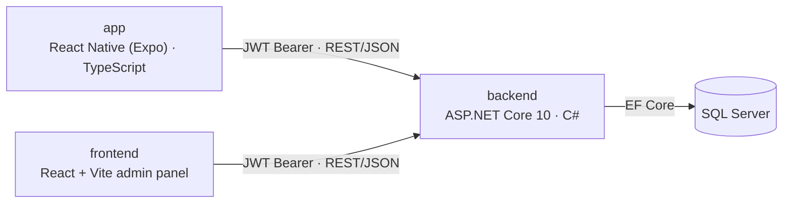

# LMS — Project Plan

Architecture overview and phased roadmap, built from the current codebase rather than a wishlist. See also `.claude/backend/SKILL.md`, `.claude/app/SKILL.md`, and `.claude/frontend/SKILL.md` for the house-style conventions each piece follows.

## Contents

- [Product overview](#product-overview)
- [System architecture](#system-architecture)
- [Data model](#data-model)
- [API surface](#api-surface)
- [Mobile app](#mobile-app)
- [Web admin](#web-admin)
- [Current-state gaps](#current-state-gaps)
- [Roadmap](#roadmap)

## Product overview

LMS is a course-based learning platform: users browse **courses** (top-level subjects like "Science" or "History"), which contain **subjects**. Each subject holds both **lessons** (written content, an optional external video link, and a list of external material links — PDFs, slides, reading material) and a bank of **questions** used to build multi-question **quizzes** scoped to one or more subjects. Taking a quiz submits answers and returns a graded, per-question breakdown, and increments the user's `questionsAnswered` count. Achievements are shown on a profile tab, computed client-side from that count (see gaps).

A separate web admin panel gives staff a CRUD interface over courses, subjects, lessons, questions (bulk CSV upload, parsed client-side), quizzes, and users — gated behind an admin-role login.

## System architecture

Two clients, one API, one database. No message queue, no cache tier — a deliberately small footprint for the current stage.



**Auth model.** Stateless JWT, issued on register/login/OTP-verify and sent as a Bearer token. Two entry points: `email + password` (register/login) or `email + OTP` (send-otp/verify-otp, account auto-created on first OTP request). Claims are `id`/`role`/`name`; `[Authorize]` gates any authenticated user, `[Authorize(Roles = "admin")]` gates admin-only actions.

**Service layer.** Unlike a typical thin-controller API, `backend/` does have a service tier: controllers are one-line delegations to an `I<Resource>Service`, which holds all business logic and talks to `AppDbContext` directly (no repository layer underneath). See `.claude/backend/SKILL.md` for the full pattern (`Result<T>`/`HttpError`, DTO mapping, etc.).

## Data model

Entity Framework Core, Code-First, against SQL Server. Courses, subjects, lessons, and questions form the content hierarchy; quizzes are a graded assessment layer built from a subject's question bank. IDs are `int` IDENTITY columns everywhere but are still serialized as `_id` over the wire, for client compatibility.

```mermaid
erDiagram
    COURSE ||--o{ SUBJECT : "contains"
    SUBJECT ||--o{ LESSON : "contains"
    SUBJECT ||--o{ QUESTION : "contains"
    SUBJECT }o--o{ QUIZ : "scopes"
    QUESTION }o--o{ QUIZ : "included in"
    USER ||--o{ QUIZ : "creates (optional)"

    USER {
        string name
        string email "unique"
        string role "user or admin"
        bool hasPassword
        number questionsAnswered
    }
    COURSE {
        string title
    }
    SUBJECT {
        string name
        string slug "auto from name"
    }
    LESSON {
        string title
        string content
        string videoUrl "optional external link"
        materials "list of external {title, url} links"
        number order
    }
    QUESTION {
        string text
        string_array options "2 to 6"
        number correctOptionIndex
        string difficulty "easy, medium, hard"
        string explanation
    }
    QUIZ {
        string title
    }
```

Quiz↔Subject and Quiz↔Question are real many-to-many join tables (`QuizSubjects`, `QuizQuestions`), not array fields — `QuizQuestions.Order` preserves question ordering. Quizzes have no time limit or difficulty field of their own (only their constituent questions carry a `difficulty`). There's no per-user `score`/`streak` — the only persisted progress signal is `User.QuestionsAnswered`. Field names shown are the subset relevant to the plan — see `backend/Models/` for the full entity classes.

## API surface

40 routes across eight resources, plus a health check. Service methods return `Result<T>`/`Result`; the controller maps failures to a `{ message }` JSON body via `ToActionResult`.

### Auth — `/api/auth`

| Method | Route | Auth | Does |
|---|---|---|---|
| POST | `/register` | public | Email + password sign-up, returns JWT |
| POST | `/login` | public | Email + password sign-in |
| POST | `/send-otp` | public | Issues a 6-digit code for an email address (currently a hardcoded stub — see gaps) |
| POST | `/verify-otp` | public | Verifies the code, creates/logs in the account |
| GET | `/me` | user | Current profile |
| PATCH | `/profile` | user | Update name |
| PUT | `/password` | user | Change password (requires current, unless the account has none yet) |

### Users — `/api/users` (admin-only at the class level)

| Method | Route | Does |
|---|---|---|
| GET | `/` | List all users |
| PATCH | `/:id/role` | Change a user's role |
| DELETE | `/:id` | Delete |

### Courses, Subjects, Lessons

| Method | Route | Auth | Does |
|---|---|---|---|
| GET | `/api/courses` | user | List courses |
| GET | `/api/courses/:id` | user | Get one |
| POST | `/api/courses` | admin | Create |
| PUT | `/api/courses/:id` | admin | Update |
| DELETE | `/api/courses/:id` | admin | Delete (blocked if it still has subjects) |
| GET | `/api/subjects` | user | List, optional `?course=` filter |
| GET | `/api/subjects/:id` | user | Get one |
| POST | `/api/subjects` | admin | Create (requires a course) |
| PUT | `/api/subjects/:id` | admin | Update |
| DELETE | `/api/subjects/:id` | admin | Delete (blocked if it still has questions or lessons) |
| GET | `/api/lessons` | user | List, optional `?subject=` filter |
| GET | `/api/lessons/:id` | user | Get one |
| POST | `/api/lessons` | admin | Create (requires a subject + title) |
| PUT | `/api/lessons/:id` | admin | Update |
| DELETE | `/api/lessons/:id` | admin | Delete |

### Questions — `/api/questions`

| Method | Route | Auth | Does |
|---|---|---|---|
| GET | `/` | user | List, optional `?subject=&difficulty=` filter |
| GET | `/:id` | user | Get one |
| POST | `/` | admin | Create |
| PUT | `/:id` | admin | Update |
| DELETE | `/:id` | admin | Delete |
| POST | `/:id/answer` | user | Answer standalone (practice mode); increments `questionsAnswered` |

### Quizzes & Home — `/api/quizzes`, `/api/home`

| Method | Route | Auth | Does |
|---|---|---|---|
| GET | `/api/quizzes` | user | List, optional `?subject=` filter |
| GET | `/api/quizzes/:id` | user | Get one, questions fully populated |
| POST | `/api/quizzes` | admin | Create (requires ≥1 subject and ≥1 question) |
| PUT | `/api/quizzes/:id` | admin | Update |
| DELETE | `/api/quizzes/:id` | admin | Delete |
| POST | `/api/quizzes/:id/start` | user | Starts an attempt, returns its questions (no answers/explanations) |
| POST | `/api/quizzes/:id/submit` | user | Submits answers, returns graded per-question results |
| GET | `/api/home/stats` | user | Dashboard counts: courses, subjects, lessons, quizzes, questionsAnswered |

## Mobile app

React Native + Expo, managed workflow (Expo CLI) — no committed native `android/`/`ios/` projects; Expo generates them on demand via `expo prebuild` only if native code is ever needed. React Context for auth state (no Redux); a single axios instance injects the JWT. See `.claude/app/SKILL.md` for the full house-style conventions this follows.

```
RootNavigator   (Login ⇄ MainTabs, gated by AuthContext; loading spinner while the token is checked)
├─ Login.tsx           — single screen, two modes: email+password, and email-based OTP request/verify
├─ MainTabs
│  ├─ HomeStack
│  │  ├─ Home.tsx          — dashboard: quiz preview list + stats, links into AllQuizzes
│  │  └─ AllQuizzes.tsx     — full list of available quizzes
│  ├─ CoursesStack
│  │  ├─ Courses.tsx        — browse courses
│  │  ├─ CourseSubjects.tsx  — subjects within a course
│  │  ├─ SubjectDetail.tsx    — Lessons/Quizzes top tabs for this subject, lists rendered inline
│  │  └─ LessonDetail.tsx      — lesson content, video link, material links (opened via Linking)
│  └─ ProfileStack
│     ├─ Profile.tsx         — user info, client-side achievements list, logout
│     ├─ Settings.tsx         — edit name
│     └─ ChangePassword.tsx    — set/change password
└─ QuizPlay.tsx        — pushed at the root-navigator level (sibling of MainTabs, not nested in a tab)
```

There is no dedicated Quizzes tab or results screen. A quiz can be opened from either `Home`/`AllQuizzes` or by drilling into `Courses → CourseSubjects → SubjectDetail`'s Quizzes tab; either path pushes `QuizPlay` on the root stack, which runs the question flow and then renders the graded per-question breakdown inline in the same screen once submitted. Lessons are reached via `SubjectDetail`'s Lessons tab → `LessonDetail`; a lesson's video and materials are external links opened with `Linking.openURL`, not played/rendered in-app. `SubjectDetail` itself is a single screen with a custom top-tab bar (Lessons/Quizzes) switching which list renders below — not a `@react-navigation` tab navigator, to avoid adding a new nav dependency for two tabs.

## Web admin

React + Vite, all seven pages behind `ProtectedRoute` (admin-role JWT required).

| Page | Backed by | Notable |
|---|---|---|
| Login | `/api/auth/login` | Only account with `role: admin` can pass `ProtectedRoute` |
| Courses | `/api/courses` | CRUD |
| Subjects | `/api/subjects` | CRUD, scoped to a course |
| Questions | `/api/questions` | Includes a bulk-upload modal that parses a CSV client-side (`utils/ExcelQuestions.ts`) then posts one `createQuestion` call per row — there's no server-side bulk endpoint |
| Lessons | `/api/lessons` | CRUD; materials are edited as a dynamic list of title/URL pairs, not file uploads |
| Quizzes | `/api/quizzes` | CRUD over title/subjects/questions |
| Users | `/api/users` | List, change role, delete — no aggregate stats (see gaps) |

## Current-state gaps

Concrete observations from reading the code, not speculation — these are what the roadmap below is built from.

**Blocks a real user flow:**

- **OTP is a hardcoded stub, not a real code.** `Handlers/OTPHandler.cs` always issues `"123456"` — it's never randomly generated and never emailed anywhere. Fine for local testing, but OTP login cannot work as a real feature until this generates a random code and actually sends it. (`backend/Handlers/OTPHandler.cs`)

**Works but incomplete:**

- **No password-reset flow for email accounts.** Only an authenticated "change password" (requires knowing the current one, unless the account has none yet) exists. A user who forgets their password has no recovery path. (`backend/Services/AuthService.cs`)
- **Achievements are computed client-side only.** Unlock state is derived on-device from `questionsAnswered` each render — nothing is persisted server-side, so there's no unlock timestamp, no push celebration moment, and admin can't see who's unlocked what. (`app/src/data/achievements.ts`)
- **No admin dashboard or aggregate stats.** Web admin is seven CRUD list pages; there's no view of DAU, quiz completion rates, or which questions are too easy/hard. (`frontend/src/pages/`)
- **No rate limiting on public auth routes.** `/login`, `/send-otp`, and `/verify-otp` are unauthenticated by design, but have no brute-force or spam throttling in front of them. (`backend/Program.cs`)
- **Lesson videos/materials are only format-checked, not reachability-checked.** Create/update rejects a non-`http(s)` or malformed URL, but nothing checks the link actually resolves, is safe, or is really a video/document — `app/`'s `LessonDetail` screen finds out only when `Linking.openURL` fails at tap time.

**Low-risk / housekeeping:**

- **No automated tests.** Neither `backend/` nor `app/` has a test project/`__tests__` directory today — fine while the surface is small, worth revisiting as it grows.
- **Default seed password is committed in plain text.** `backend/Seeders/UserSeeder.cs` hardcodes the bootstrap admin/demo passwords. Fine for local dev; worth moving to config/env before that seeder ever touches a shared environment.
- **`Microsoft.OpenApi` 2.0.0 has a known moderate-severity advisory** (`NU1903`, transitive via `Microsoft.AspNetCore.OpenApi`) — surfaces as a build warning; worth bumping once a patched version is available.

## Roadmap

A suggested order, not a committed schedule — each phase is built directly from a gap above, sequenced so nothing depends on a later phase. Reorder freely against your own priorities.

### Phase 0 — Housekeeping _(Now)_

Low-risk cleanup that removes drift before it compounds.

- Move the hardcoded seed passwords out of source into config/env
- Bump `Microsoft.OpenApi` once a patched version is available
- Stand up minimal test setups — even smoke tests for auth + the quiz submit/scoring path

### Phase 1 — Harden the core loop _(Next)_

Make the auth flow safe to put in front of real users.

- Replace the hardcoded OTP stub with real random generation + an email provider (SendGrid/SES/etc.)
- Add a forgot/reset-password flow for email accounts
- Rate-limit `/login`, `/send-otp`, `/verify-otp`
- Persist achievement unlocks on the User entity instead of computing client-side only
- Validate lesson video/material URLs a bit further (reachability, expected content type) before trusting them in-app

### Phase 2 — Engagement _(Later)_

Give users reasons to come back beyond finishing a quiz or reading a lesson.

- Track lesson-read/completion state per user, the way `questionsAnswered` tracks quiz activity
- Push notifications for new-lesson/new-quiz nudges
- A lightweight progress signal (e.g. lessons read + quizzes passed) surfaced on the profile tab

### Phase 3 — Admin insights _(Later)_

Give the people running content something to act on.

- A Dashboard page in the web admin: active users, quiz completion rate, per-question accuracy, lesson view counts
- Surface `CreatedBy` (already on `Quiz`) as a visible audit trail in the admin tables

### Phase 4 — Scale & release _(Later)_

What kicks in once real usage shows up.

- Performance pass on quiz/lesson question-pool queries at scale — indexes on `SubjectId`
- App store release prep: icons, splash, privacy policy, staged rollout
- Decide a monetization model (ads vs. subscription) if the product needs one

---

This plan doesn't assume any roadmap decisions beyond what's already implied by existing fields and half-built UI — treat phases 2 onward as a starting proposal to react to, not a backlog.
